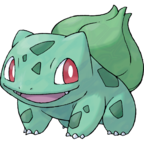

# [uLogMe](https://github.com/Naereen/uLogMe/) notification icons
[uLogMe](https://github.com/Naereen/uLogMe/) icons uses different icons, [randomly (to solve #7)](https://github.com/Naereen/uLogMe/issues/7), for the desktop notifications (sent by [`notify.notify()`](../notify.py)) (cf. [this comment](https://github.com/Naereen/uLogMe/commit/74165d89e237824689d736a3f92cc94d68444991#commitcomment-19609235)).

> The images come from http://bulbapedia.bulbagarden.net/wiki/.

> /!\ I do not own any of these images!
> Fair use, only for fun for a local application.

# List of different possible icons
## Bulbasaur  

## Charmander  

## Dratini  

## Pikachu  

## Snorlax  

## Squirtle  

